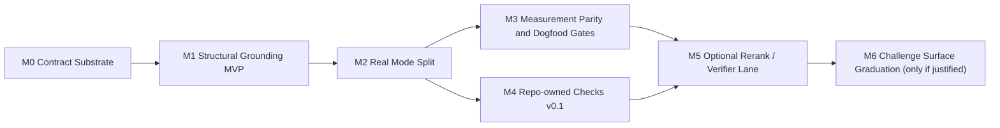

# Review Implementation Roadmap v1 (2026-04-24)

```
Status: DRAFT
Scope: implementation roadmap and milestone plan, no code changes in this document
Depends on:
  - docs/plans/2026-04-24-review-architecture-v1.md
  - docs/plans/2026-04-24-review-design-external-baseline.md
  - docs/anti-hallucination-roadmap.md
  - docs/anti-hallucination-roadmap.md
Issue: #12
```

## 1. Why this doc exists

The architecture doc settles **what** glm-plugin-cc should become.
This roadmap settles **how we should actually build it** without wasting the
investigation work or smearing scope across too many half-features.

The goal is not "implement every interesting idea."
The goal is to turn the validated design into an execution order that improves:

- trust in findings
- visible differentiation between `/glm:review` and
  `/glm:adversarial-review`
- review quality without avoidable latency/cost blow-ups
- long-term maintainability of the review runtime

## 2. Verified Starting Point

These are the implementation facts the roadmap starts from.

1. Both `/glm:review` and `/glm:adversarial-review` still run through the same
   `runReview()` entry point in `scripts/glm-companion.mjs`.
2. The current runtime is still **single-pass** at the review level:
   companion collects git context, builds one prompt, calls
   `runGlmReview()`, renders, and stores the result.
3. The current stored/reported finding shape is still the v0.4.7 shape in
   `schemas/review-output.schema.json`:
   - `severity`
   - `title`
   - `body`
   - `file`
   - `line_start`
   - `line_end`
   - `confidence`
   - `recommendation`
4. `scripts/lib/render.mjs` still only understands the old finding contract.
   It does not yet know about:
   - `confidence_tier`
   - `validation_signals`
   - `rejected`
   - `repo_checks`
5. There is no `scripts/lib/validators/` subtree yet.
6. `commands/review.md` says balanced review does not support extra focus text,
   but `scripts/glm-companion.mjs` still collects trailing positionals into
   `focusText` and injects them into `USER_FOCUS`.
7. Empirical evaluation still leans heavily on `/glm:adversarial-review`.
   `/glm:review` still lacks comparable direct measurement.

Implication:
we are **not** starting from zero, but we are also **not** starting from an
already-grounded reviewer.

## 3. Delivery Principles

These principles control milestone ordering and feature cuts.

### 3.1 Trust lift before feature breadth

The first implementation priority is not "more clever prompting."
It is making findings easier to trust and easier to inspect.

That means:

- schema/evidence substrate before fancy passes
- structural validation before second-model experiments
- stored auditability before UI polish

### 3.2 One remote review call by default until proven otherwise

Through the mainline milestones, the default review path should remain:

- one GLM review call
- plus local deterministic passes

We should **not** make a second remote model call the default path until:

- structural validation exists
- measurement says the weak tail is still meaningful
- the latency/cost trade-off is justified

### 3.3 Keep review and security evaluation separate

We should import useful ideas from challenge/security systems, but not their
entire product surface.

In this roadmap:

- adversarial review gets better challenge semantics
- repo-owned checks stay narrow
- full security evaluation remains out of scope

### 3.4 Favor replayable evidence over renderer-only cleverness

Any information hidden in UI filters must still remain in stored job JSON.

That means:

- raw findings remain inspectable
- rejected findings remain auditable
- pass status survives renderer truncation

### 3.5 Ship in narrow PR slices

Do not bundle:

- schema changes
- validator logic
- prompt rewrites
- repo-owned checks
- reflect-model experiments

into one mega-PR.

Each milestone below should ship as one focused PR or a very small PR set.

## 4. Roadmap Shape

The architecture doc's `S0-S5` stages are conceptual.
They should **not** be treated as mandatory commit order.

The recommended implementation order is:



### 4.1 Why this order

This order is optimized for quality and runtime stability:

1. **M0 first** because everything else needs a stable result contract.
2. **M1 before rerank** because trust lift from deterministic validation is
   stronger and cheaper than immediately adding another model pass.
3. **M2 before repo checks** because users should feel the two review modes
   diverge even without repo policy modules.
4. **M3 before optional second-pass features** because we need balanced-mode
   data and pass-level timing before making the pipeline heavier.
5. **M4 before security-shaped ideas** because repo-owned checks are the
   smallest bounded way to add hard local policy.
6. **M5 and M6 stay optional** so the product does not drift into "expensive
   cleverness by default."

### 4.2 Summary table

| Milestone | Outcome | Primary files/modules | Default-on impact |
|---|---|---|---|
| M0 | schema + job substrate + contract cleanup | `schemas/review-output.schema.json`, `scripts/glm-companion.mjs`, `scripts/lib/render.mjs`, `commands/review.md` | low risk |
| M1 | structural grounding MVP | `scripts/lib/validators/*.mjs`, `scripts/glm-companion.mjs`, `scripts/lib/render.mjs` | medium trust lift, local-only cost |
| M2 | real user-visible mode split | `prompts/*.md`, `commands/*.md`, `scripts/lib/render.mjs` | better product differentiation |
| M3 | balanced/adversarial measurement parity + pass telemetry | `test-automation/review-eval/*`, `tests/*` | no user-visible behavior change |
| M4 | repo-owned checks v0.1 | new `.glm/checks/` contract + companion wiring | opt-in only |
| M5 | optional rerank / cross-model verifier lane | `scripts/glm-companion.mjs`, `scripts/lib/glm-client.mjs` or adjacent verifier module | opt-in only |
| M6 | challenge-surface graduation | prompt/context/report split only if data supports it | deferred by default |

## 5. Milestone Detail

## 5.1 M0 - Contract substrate and drift cleanup

### Goal

Create the minimum substrate needed for later grounding work without changing
the default review path into a multi-pass system yet.

### In scope

1. Extend the shared review result schema to safely accept:
   - `confidence_tier`
   - `validation_signals`
   - `rejected`-capable state
2. Make renderers and job readers tolerant of the new shape.
3. Add pass-level job metadata so later stages can record:
   - model pass status
   - validation pass status
   - optional rerank status
4. Resolve the known `/glm:review` focus-text drift.

### Recommended product call

Balanced review should stay **non-steerable by arbitrary free-form focus text**
in v1.

That means M0 should align runtime with the current user-facing command contract
by doing one of the following:

- ignore trailing focus text in `/glm:review`, or
- reject it with a clear usage error

Recommended choice: **reject with a clear usage error**.
It is easier to explain and keeps the mode split honest.

### Primary code surfaces

- `schemas/review-output.schema.json`
- `scripts/glm-companion.mjs`
- `scripts/lib/render.mjs`
- `scripts/lib/job-control.mjs`
- `scripts/lib/tracked-jobs.mjs`
- `commands/review.md`
- `tests/render.test.mjs`
- `tests/result-propagation.test.mjs`
- `tests/template-contract.test.mjs`

### Acceptance

1. Old stored review jobs still replay cleanly.
2. New stored review jobs can carry tier/signal/pass metadata without renderer
   crashes.
3. `/glm:review` command/help text and runtime behavior are aligned again.
4. No default second model call exists.
5. No finding is silently upgraded to "validated" through renderer tricks.

### Why M0 matters

Without this milestone, every later trust feature ends up bolted onto an
unstable result contract and the diff will sprawl across unrelated files.

## 5.2 M1 - Structural grounding MVP

### Goal

Ship the first real trust lift:
finding-level deterministic validation that is local, narrow, and cheap.

### In scope

Implement the v1 structural validators from the architecture doc:

1. `file_in_target`
2. `line_range_in_file`
3. `anchor_literal_found`
4. `known_false_reference_absent`

### Design shape

Create a pure validation library subtree:

- `scripts/lib/validators/`

Recommended internal split:

- `index.mjs` or equivalent orchestration helpers
- `file-in-target.mjs`
- `line-range-in-file.mjs`
- `anchor-literal-found.mjs`
- `known-false-reference-absent.mjs`

The companion should orchestrate these validators, but the validator logic
itself should stay pure and fixture-testable.

### Runtime behavior

M1 should be able to:

- keep raw findings
- assign `proposed`, `cross-checked`, or `rejected`
- persist validation signals
- hide `rejected` from default human output while keeping it in stored JSON

`deterministically-validated` can exist in the schema at this stage, but M1
does not need to produce it yet unless a local deterministic proof source
already exists.

### Primary code surfaces

- `scripts/lib/validators/*.mjs`
- `scripts/glm-companion.mjs`
- `scripts/lib/render.mjs`
- `tests/review-payload.test.mjs`
- new validator unit tests
- `tests/job-render.test.mjs`

### Acceptance

1. Structural fabrication classes are visible in machine-readable output.
2. Obviously broken file/line/anchor claims no longer look identical to live
   candidate findings.
3. Validation failures do not fail the whole job.
4. The default runtime still uses a single remote GLM call.
5. Validator cost is local-only and target-scoped.

### Performance stance

M1 should not scan the whole repo by default.
Validation should operate on:

- the already-selected target set
- the collected review context
- any explicit anchor literals returned by the model

## 5.3 M2 - Real mode split users can feel

### Goal

Make `/glm:review` and `/glm:adversarial-review` visibly different as products,
not just prompts with a different adjective.

### In scope

1. Clean-room prompt rewrite for both modes.
2. Renderer default policy split:
   - `/glm:review`
     - min tier `cross-checked`
     - min severity `medium`
     - cap `5`
   - `/glm:adversarial-review`
     - min tier `proposed`
     - min severity `low`
     - cap `15`
3. Challenge-surface declaration for adversarial review.

### CLI recommendation

Do not invent a large mode matrix.
If challenge surfaces become explicit in the command surface, keep it minimal:

- a single repeatable `--surface <tag>` flag, or
- a compact comma-separated equivalent

That is enough for v1.
Do not introduce pack-specific flags yet.

### Recommended UX call

M2 should preserve one shared stored result object, but allow the renderer to
surface each mode differently by default.

That means:

- balanced review can legitimately render "no material findings"
- adversarial review can still return no findings, but should summarize in a
  challenge-framed voice rather than an LGTM-framed voice

### Primary code surfaces

- `prompts/review.md`
- `prompts/adversarial-review.md`
- `commands/review.md`
- `commands/adversarial-review.md`
- `scripts/lib/render.mjs`
- `tests/template-contract.test.mjs`
- `tests/render.test.mjs`

### Acceptance

1. The two modes are distinguishable without reading source code.
2. Renderer defaults match the architecture doc's filter policy.
3. Help text matches real runtime behavior.
4. Adversarial mode remains bounded; it does not silently become a security
   product.

## 5.4 M3 - Measurement parity and dogfood gates

### Goal

Stop flying blind on balanced review and give later optional features a real
decision basis.

### In scope

1. Extend `test-automation/review-eval/` so it can exercise:
   - `/glm:review`
   - `/glm:adversarial-review`
2. Extend summaries/sidecars to capture:
   - tier distribution
   - rejected counts
   - pass-level timings
   - per-mode latency
3. Add a lightweight dogfood review packet for milestone validation:
   - candidate PR
   - sampled findings
   - human spot-check notes

### Important honesty rule

M3 should **not** invent fake certainty targets such as:

- "fabrication down to X%"
- "rerank improves by Y%"

unless the measurement design is actually good enough to support them.

For now the expected output is:

- better evidence
- better comparison
- better go/no-go decisions for later stages

### Primary code surfaces

- `test-automation/review-eval/scripts/run-experiment.mjs`
- `test-automation/review-eval/scripts/summarize.mjs`
- `test-automation/review-eval/README.md`
- targeted tests around any new result fields

### Acceptance

1. Balanced review is no longer empirically invisible.
2. Later decisions about rerank/verifier stages can cite pass-level data.
3. The repo has a repeatable dogfood lane that does not depend on memory or
   chat transcripts.

## 5.5 M4 - Repo-owned checks v0.1

### Goal

Introduce the smallest safe repo-policy surface that adds hard local checks
without turning review into an unbounded policy engine.

### In scope

1. `.glm/checks/` config path
2. exactly two check kinds:
   - `grep-exists`
   - `grep-notpresent`
3. separate `repo_checks` output section

### Deliberate exclusions

Do **not** add in M4:

- `test-passes`
- arbitrary shell commands
- free-form markdown policy execution
- ranking merge between repo checks and model findings

### Primary code surfaces

- new repo-check loader/validator module
- `scripts/glm-companion.mjs`
- schema/result storage
- renderer support for a separate `repo_checks` section
- tests for config parsing and result emission

### Acceptance

1. Repo checks are optional and schema-validated.
2. Built-in findings and repo check results remain separately inspectable.
3. No command execution enters the review path.
4. This milestone does not change the bounded product boundary.

## 5.6 M5 - Optional rerank / verifier lane

### Goal

Add a place for genuinely optional second-pass quality experiments without
making the default review path slower or blurrier.

### In scope

Possible experiments:

1. reflection/rerank pass
2. cross-model narrow verifier
3. `--reflect-model <name>` or equivalent opt-in surface

### Entry condition

Do not start M5 just because the idea is attractive.
Start only if M3 evidence shows a meaningful weak tail remains after M1/M2.

### Product stance

M5 is **not** allowed to silently become the new default review path.

Any second-pass feature should launch as:

- opt-in
- auditable
- pass-timed
- revertable

### Acceptance

1. Optional pass failures degrade gracefully to the strongest earlier result.
2. Stored results record both pre-rerank and final confidence metadata when
   applicable.
3. The performance/cost trade-off is visible rather than hidden.

## 5.7 M6 - Challenge-surface graduation

### Goal

Decide whether any challenge surface deserves to become more than a tag.

### Graduation rule

Only graduate a challenge surface if it implies at least one of:

1. distinct context collection
2. distinct deterministic validation hooks
3. distinct severity/report structure

If none of these are true, keep it as a tag.

### Why this stays last

This is where cargo-cult risk is highest.
If we move too early, we will just build "prompt switch cases with more nouns."

## 6. Cross-Cutting Quality and Performance Tracks

These tracks should run alongside the milestones above.

## 6.1 Track Q - Verification discipline

Every milestone should ship with:

- unit coverage on the new local logic
- at least one stored-job replay or backward-compat check
- updated command/help/docs when behavior changes

## 6.2 Track P - Performance and cost control

Until M5, the performance posture should be:

- one remote GLM call by default
- local deterministic work only
- no full-repo scan by default
- no command execution for repo checks

Pass-level timing should be recorded before any default-on second-pass feature
is even discussed.

## 6.3 Track D - Docs/runtime alignment

This repo already has proof that command docs and runtime behavior can drift.

Every milestone that changes:

- prompt behavior
- CLI semantics
- renderer filtering
- stored result shape

must include its own docs update in the same milestone.

## 7. Recommended PR Slicing

The roadmap should translate into small, reviewable PRs.

Recommended first cut:

1. **PR-A / M0**
   - schema + renderer tolerance + job pass envelope + review focus drift fix
2. **PR-B / M1**
   - validator library + companion wiring + tier assignment
3. **PR-C / M2**
   - prompt contract rewrite + renderer default split + command/help sync
4. **PR-D / M3**
   - harness parity + timing capture + README update
5. **PR-E / M4**
   - `.glm/checks/` loader + two grep check kinds + `repo_checks` output
6. **PR-F / M5**
   - optional reflect-model or cross-model verifier experiment

If one PR begins to touch both:

- schema + validators, or
- prompts + repo checks, or
- measurement + optional second-pass features

it is probably too broad.

## 8. Deferred Backlog

These items are intentionally **not** on the near-term critical path:

1. command-executing repo checks such as `test-passes`
2. default-on second-model verification
3. full security evaluation surface
4. pack-level challenge architecture
5. auto-fix behavior
6. any claim of full semantic-faithfulness guarantee

## 9. Recommended Next Implementation Start

If implementation begins, the first execution target should be **M0 / PR-A**.

Why:

- it unblocks every later milestone
- it resolves a known contract drift immediately
- it gives later validators and renderers a stable shape to stand on
- it does not force a latency/cost decision yet

The first coding sprint should **not** start with:

- repo-owned checks
- reflect-model support
- challenge-surface pack ideas

Those are valuable later, but they are not the fastest path to a better
reviewer.

## 10. Exit Condition For This Planning Phase

This roadmap is "ready enough to start implementation" when:

1. the milestone order is accepted
2. M0 is accepted as the first slice
3. it is clear which follow-on issue or PR should represent PR-A

At that point the work stops being architecture-only discussion and becomes a
normal implementation lane with code, tests, and verification.
